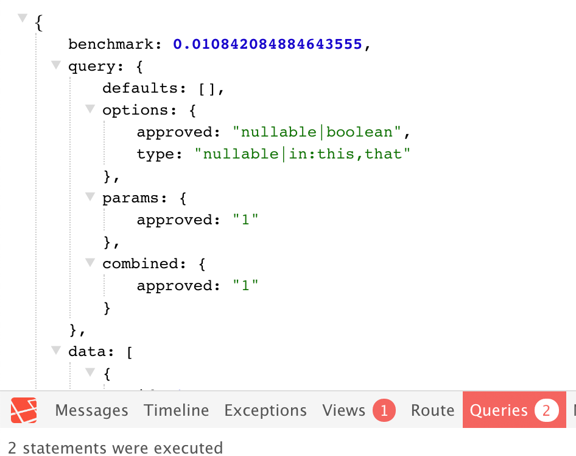

<p align="center">
  
</p>

> Enahnce your Laravel API 

[](https://choosealicense.com/licenses/apache-2.0/)
[](https://packagist.org/packages/acidjazz/metapi)
[](https://packagist.org/packages/barryvdh/metapi)

## Example Output

```php
class OrgController extends Controller
{
    /**
    * Display a listing of the resource.
    *
    * @return \Illuminate\Http\Response
    */
    public function index(Request $request)
    {
        $this->option('approved', 'nullable|boolean');
        $this->option('type', 'nullable|in:this,that');
        $this->verify();
        ...
        $this->render($results);
```

`GET /endpoint?approved=1`

```json
{
    "benchmark": 0.011060953140258789,
    "query": {
        "defaults": [],
        "options": {
            "approved": "nullable|boolean",
            "type": "nullable|in:this,that"
        },
        "params": {
            "approved": "1"
        },
        "combined": {
            "approved": "1"
        }
    },
    "data": [
        {
```

`GET /endpoint?callback=bob`

```js
bob({
    "benchmark": 0.011017084121704102,
    "query": {
        "defaults": [],
        "options": {
            "approved": "nullable|boolean",
            "type": "nullable|in:this,that"
        },
        "params": [],
        "combined": []
    },
    "data": [
        {
```

`GET /endpoint?approved=1` .. dev env, works with [ laravel-debugbar](https://github.com/barryvdh/laravel-debugbar)



## Features
* Endpoint benchmarking
* Laravel Validation wrapper that reflects requirements
* Support for JSON, JSONP, and interactive syntax highlighted


## Installation

Install metapi with [composer](https://getcomposer.org/doc/00-intro.md):
```bash
composer require acidjazz/metapi
```

Make your `app/Http/Controllers/Controller.php` extend this library
```php
class Controller extends \acidjazz\metapi\MetApiController
{
```
